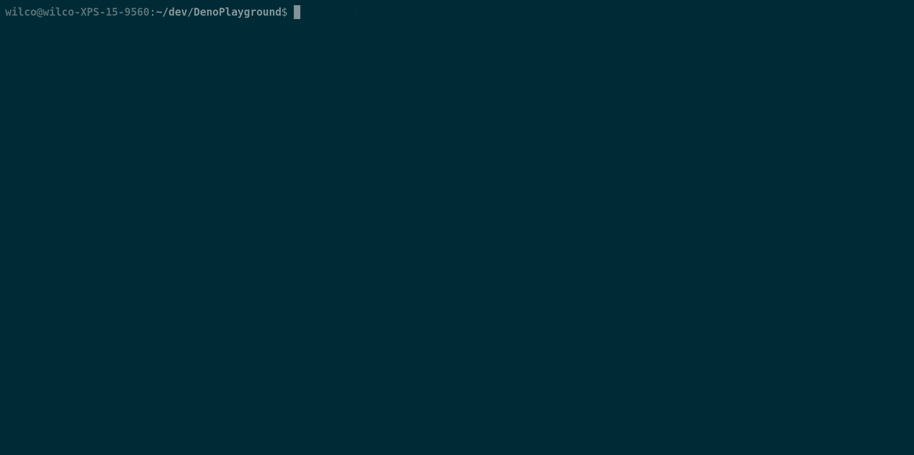

# Exact Online API Explorer

Exact Online API Explorer helps you build Exact Online extensions by enabling
you to play with the API.

- Built on the Deno runtime.
- Easy set-up (bring your own API-keys!).
- Has all (non-beta)
  [Exact APIs](https://start.exactonline.co.uk/docs/HlpRestAPIResources.aspx?SourceAction=10)
  built-in.
- Remembers your commands.
- Formats the output.

  

# Usage (installing)

1. Install [Deno](https://deno.land/#installation).
2. Run the installation command:

`deno install --unstable --allow-read=. --allow-write=. --allow-net=0.0.0.0,start.exactonline.nl https://raw.githubusercontent.com/WilcoKruijer/ExactApiExplorer/main/exact_explorer.ts`

3. Initialize the local SQLite database & run the program:
   `exact_explorer --migrate=up`
4. Follow the set-up instructions.
5. Enjoy!

# Usage (cloning)

1. Install [Deno](https://deno.land/#installation).
2. Clone this repostiory.
3. Initialize the local SQLite database & run the program:

`deno run --unstable --allow-read=. --allow-write=. --allow-net=0.0.0.0,start.exactonline.nl --lock lock.json exact_explorer.ts --migrate=up`

4. Follow the set-up instructions.

# Deno specifics

The application was tested with Deno version `1.11.5.` and stdlib `0.100.0`. The
following flags are used:

- `--unstable`: Used to access `Deno.setRaw()`. This means this application
  might break with future versions of Deno.
- `--allow-read=.` an SQLite database-file is stored in the current working
  directory, this flag is used to read from it.
- `--allow-write=.` Same as above.
- `--allow-net=0.0.0.0,start.exactonline.nl` During the setup this application
  temporarily runs a webserver to collect Exact's authorization code. Access to
  the Exact website is obvious.
